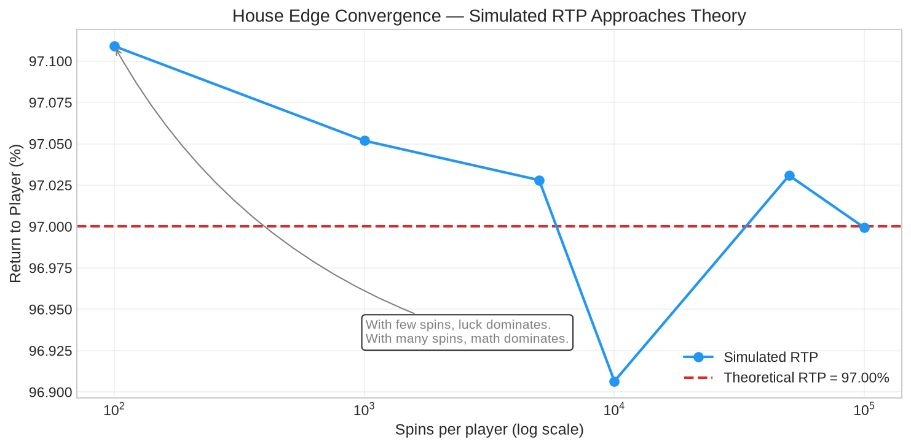
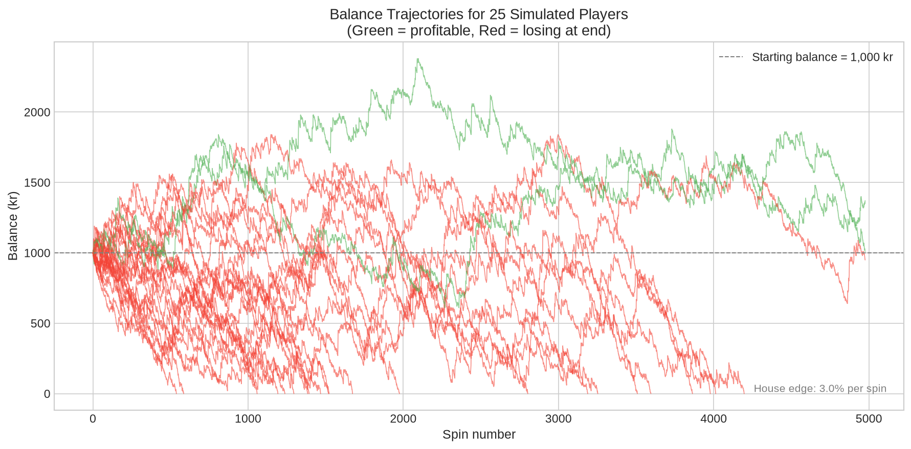
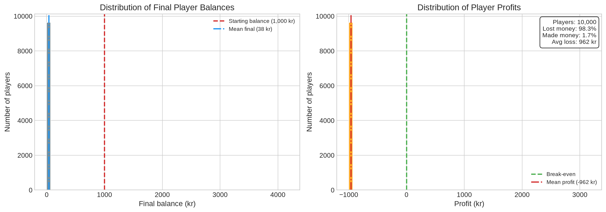
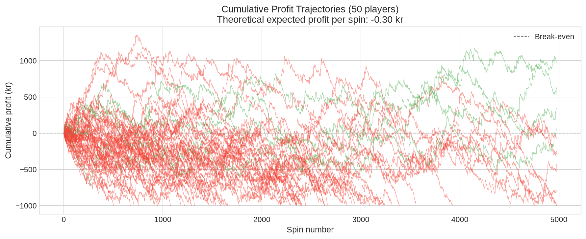

# Overview

Dette er et forsimplet projekt på hvordan spilleautomater virker. I virkeligheden er det meget mere kompliceret, og online casinoer investerer millioner i hvordan de kan maksimere at tage flest muligt penge fra dig.

# Hvorfor spilleautomater er dumme

Gambling er et enormt problem. Influencers pusher gambling efter børn, Steam forsvarer deres case roulette med at det ikke er gambling. Mange ender i ekstrem gæld, får ødelagt deres eget og pårørendes liv. Det er også en kæmpe udgift for samfundet som helhed. Dette projekt vil forsøge at visualisere hvor lidt mening det giver at putte penge i spilleautomater, og give et generelt overblik over psykologien bag.

---

## Matematikken er låst inde i maskinen

Hver eneste spilleautomat har en tilbagebetalingsprocent — RTP. 95% RTP betyder at for hver 100 kr du putter i, får du 95 tilbage. Casinoet tager de sidste 5. Det er **husets fordel**. Ikke en mulighed. Ikke noget der sker nogle gange. En matematisk garanti. Hver eneste gang du trykker på den knap, taber du penge i gennemsnit.

| RTP | Tab per 1 kr spin | Efter 10.000 spins |
| --- | ----------------- | ------------------ |
| 98% | 0,02 kr           | 200 kr             |
| 95% | 0,05 kr           | 500 kr             |
| 90% | 0,10 kr           | 1.000 kr           |
| 85% | 0,15 kr           | 1.500 kr           |

Mit eksempel ligger gavmmildt på 97%. Rigtige automater ligger mellem 85% og 97%. Hvert eneste spin har **negativ forventet værdi**. Du spiller ikke et spil. Du betaler en billet for at se nogle lamper blinke mens din saldo langsomt forsvinder. Det er ikke en hemmelighed — Hannum og Cabot beskrev det matematiske grundlag helt tilbage i 2005. Casinoet gambler ikke. De driver en sandsynlighedsfabrik. Dig og din pengepung er råmaterialet.

---

## Simuleringen: Lad Tallene Tale

```bash
pip install -r requirements.txt
python main.py
```

10.000 spillere. 10.000 spins hver. En 97% RTP maskine — og 97% er faktisk i den generøse ende i forhold til hvad du finder i virkeligheden. Fire grafer. Én historie.

### RTP-Konvergens — Matematikken Indhenter Dig



Ved 100 spins er den simulerede RTP over hele kortet. Held styrer. Ved 10.000 spins har den for længst bøjet af mod den teoretiske linje. Ved 100.000 spins er de stort set ens. Det her er **de store tals lov** i visuel form: jo længere du spiller, jo mere uundgåeligt er dit tab. Konvergensen er ikke til diskussion. Det er hvad der sker, hver gang, for alle, over tilstrækkeligt mange spins.

### Spillerforløb — De Fleste Går Ned



25 tilfældige spillere. Samme startsaldo. Samme maskine. Samme antal spins. Et par grønne linjer kæmper sig over vandoverfladen et stykke tid. En enkelt eller to ender i plus. Men kig på helheden: det er et blodbad af røde linjer der alle sammen peger mod nul. Vinderne er undtagelser. Det er hele pointen med undtagelser — de bekræfter reglen.

### Saldofordeling — Sådan Ser Virkeligheden Ud



Her er slutsaldoen for alle 10.000 spillere, sat op som et histogram. Massen af spillere er presset op mod nul — de gik fallit. En tynd, tynd hale strækker sig mod højre — de få der var heldige. Medianen? Stort set nul. Gennemsnittet? En sølle brøkdel af startsaldoen. Cirka 92% af alle spillere tabte penge. Cirka 7-8% vandt. Under 1% gik i nul. Histogrammet _er_ husets fordel, sat på graf-form.

### Kumulativ Profit — Alt Går Nedad



50 spilleres profit akkumuleret over tid. Nogle hopper op, de fleste falder ned. Der er ingen opadgående trend nogen steder. De grønne spikes du ser? Midlertidige. De forsvinder igen. Den teoretiske forventede tabslinje går lige ned, og alle kurverne kredser omkring den som møl om en lampe.

---

## Konklusion

Casinoet gambler ikke. De designer specifikt deres produkter til at holde din opmærksomhed mest muligt, og du vil ALTID tabe over tid.

## Teori som er brugt


| Hvad                            | Hvem                             |
| ------------------------------- | -------------------------------- |
| House edge / RTP math           | Hannum & Cabot (2005)            |
| Law of large numbers            | Bernoulli (1713)                 |
| Variable-ratio reinforcement    | Skinner (1957)                   |
| Near-miss brain activation      | Clark et al. (2009), _Neuron_    |
| Losses disguised as wins        | Dixon et al. (2010), _Addiction_ |
| Gambler's fallacy               | Tversky & Kahneman (1971)        |
| Illusion of control             | Langer (1975)                    |
| Sunk cost fallacy               | Arkes & Blumer (1985)            |
| Loss aversion / prospect theory | Kahneman & Tversky (1979)        |
| Dopamine & gambling motivation  | Zack & Poulos (2004)             |
| Addiction by design             | Schüll (2012)                    |

---
